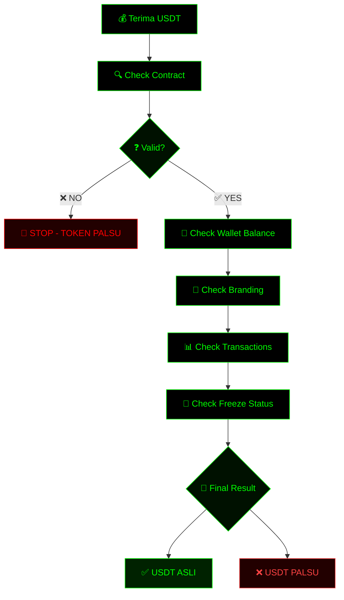

<h1 align="center">🔐 Cara Membedakan TOKEN USDT Asli dan Palsu</h1>

  
  
  
  
  

  <b>🔎 Panduan Lengkap Verifikasi USDT Asli vs Palsu</b> 
  <i>Stay Safe • Verify Before Trust • Anti Scam</i>

---

  

## 📚 Daftar Isi

* [Pendahuluan](#-pendahuluan)
* [Verifikasi Alamat Kontrak USDT](#-verifikasi-alamat-kontrak-usdt)
* [Konfirmasi Penerimaan & Branding](#-konfirmasi-penerimaan--branding)
* [Waspada Penipuan](#-waspada-penipuan)
* [Platform Terpercaya & Freeze Check](#-platform-terpercaya--freeze-check)
* [Studi Kasus](#-studi-kasus)
* [Diagram Verifikasi](#-diagram-verifikasi)
* [Perbandingan USDT](#-perbandingan-usdt)
* [ERC-20 vs TRC-20](#-erc-20-vs-trc-20)
* [Kesimpulan](#-kesimpulan)

---

## 📖 Pendahuluan

**USDT (Tether USD)** adalah stablecoin paling populer di dunia crypto. Nilainya stabil mengikuti USD, sehingga sering digunakan untuk:

* 💰 Transfer dana
* 🔄 Trading
* 🌍 Pembayaran lintas negara

⚠️ Namun, banyak **token palsu** beredar yang meniru USDT.

➡️ Tujuan artikel ini:

* Mengajarkan cara **membedakan USDT asli vs palsu**
* Menggunakan tools resmi seperti **Etherscan & Tronscan**
* Menghindari **penipuan crypto**

---

## 🔍 Verifikasi Alamat Kontrak USDT

### 📌 Alamat Resmi

| Network | Contract                                     |
| ------- | -------------------------------------------- |
| ERC-20  | `0xdac17f958d2ee523a2206206994597c13d831ec7` |
| TRC-20  | `TR7NHqjeKQxGTCi8q8ZY4pL8otSzgjLj6t`         |

---

### 🧠 Cara Cek:

#### ✅ Etherscan (ERC-20)

* Buka: https://etherscan.io
* Paste alamat kontrak
* Pastikan:

  * ✔ Verified Contract
  * ✔ Supply besar
  * ✔ Holder banyak

#### ✅ Tronscan (TRC-20)

* Buka: https://tronscan.org
* Cari alamat kontrak
* Pastikan data sesuai

---

### 🚨 Indikator Token Asli

* ✔ Source code verified
* ✔ Banyak transaksi
* ✔ Holder ribuan/jutaan
* ✔ Nama & simbol valid

---

## 💼 Konfirmasi Penerimaan & Branding

### 📥 Cek Token Masuk

* Lihat wallet (Metamask / Trust Wallet)
* Cek di explorer:

  * **Token Transfers**
  * **Transactions**

---

### 🎨 Cek Branding

* Logo resmi Tether
* Nama: **Tether USD**
* Symbol: **USDT**

🚫 Jika ada typo / logo beda → **WASPADA**

---

## ⚠️ Waspada Penipuan

### ❌ Fake Wallet Checker

Jangan percaya:

* Website random
* Tools tanpa reputasi

✔ Gunakan:

* Etherscan
* Tronscan

---

### ❌ Janji Tidak Masuk Akal

* "Profit tinggi tanpa risiko"
* "USDT bisa digandakan"
* "Flash balance permanen"

👉 Itu **SCAM 100%**

---

## 🏦 Platform Terpercaya & Freeze Check

### ✅ Gunakan Platform Resmi

* Binance
* Coinbase
* Kraken
* Bitget

---

### 🧊 Cek Status Freeze

#### ERC-20:

1. Buka Etherscan
2. Tab: `Read Contract`
3. Cari:

   * `getBlackListStatus`
   * `isBlackListed`

#### TRC-20:

* Cek via Tronscan blacklist function

📌 Status:

* `False` = Aman
* `True` = Dibekukan ❌

---

## 📊 Studi Kasus

### ✅ Kasus USDT Asli

* Contract sesuai
* Logo benar
* Banyak transaksi

---

### ❌ Kasus USDT Palsu

* Contract beda
* Nama mirip (contoh: USDTX)
* Tidak ada aktivitas

---

### 🧊 Kasus Freeze

* Saldo ada ❗
* Tidak bisa kirim ❗

👉 Penyebab: **Blacklist oleh Tether**

---

## 🔁 Diagram Verifikasi USDT (Flowchart)

## 📋 Perbandingan USDT Asli vs Palsu

| Indikator   | USDT Asli | USDT Palsu   |
| ----------- | --------- | ------------ |
| Contract    | Resmi     | Fake         |
| Source Code | Verified  | Tidak jelas  |
| Branding    | Konsisten | Modifikasi   |
| Holder      | Banyak    | Sedikit      |
| Transaksi   | Aktif     | Sepi         |
| Freeze      | Tidak     | Bisa terjadi |

---

## ⚙️ ERC-20 vs TRC-20

| Aspek    | ERC-20       | TRC-20   |
| -------- | ------------ | -------- |
| Network  | Ethereum     | TRON     |
| Fee      | Lebih mahal  | Murah    |
| Speed    | Lebih lambat | Cepat    |
| Explorer | Etherscan    | Tronscan |

---

## ✅ Kesimpulan

🔑 **5 Langkah Wajib:**

1. ✔ Verifikasi kontrak
2. ✔ Cek saldo & transaksi
3. ✔ Periksa branding
4. ✔ Hindari scam tools
5. ✔ Cek blacklist

---

## 🚀 Ringkasan Singkat

* USDT asli = **contract valid + aktivitas tinggi**
* USDT palsu = **contract beda + manipulasi**
* Jangan percaya janji profit instan
* Selalu gunakan explorer resmi

---

## 📌 Referensi

* Etherscan
* Tronscan
* Dokumentasi Tether
* Bitget Guide
* Trustee Wallet

---

## ⭐ Support

Jika repo ini membantu:

* ⭐ Star repo ini
* 🍴 Fork untuk belajar
* 📢 Share ke teman

---

> 🔐 *Stay Safe in Crypto — Verify Before Trust!*

---

### ✅ Gaspol Coding Squad Indonesia! 🚀💻  
Belajar sambil praktek langsung.  
Run it, understand it.  
Mini project Python yang gak bikin ngantuk!  

---

### ☕ Buy me a coffee  
<strong>Dukung terus biar semangat bikin karya edukatif lainnya...</strong> 
☕ <a href="https://www.paypal.com/paypalme/bungtempong99" target="_blank">Buy Me a Coffee via PayPal</a>

---

### ❤️ INITIATING HUMANITY MODE… for Down Syndrome  
<table align="center">
  <tr><th>Target</th><td>Anak-anak Pejuang Down Syndrome</td></tr>
  <tr><th>Status</th><td>Butuh Dukungan</td></tr>
  <tr><th>Aksi</th><td>Buka Hati + Klik Link = Senyum Baru</td></tr>
</table>

<em>Mereka bukan berbeda. Mereka hadir untuk mengajarkan kita arti cinta sejati dan kesabaran.</em>

---

### 💳 Dukungan Pembayaran / DONASI

  
  &nbsp;&nbsp;
  
  &nbsp;&nbsp;
  

 

⭐ Kalau project ini bermanfaat, kasih ⭐ dan share ke teman-temanmu! 
Follow <a href="https://x.com/KongAli50422468" target="_blank">@kongali1720</a> untuk update seru 🔥

